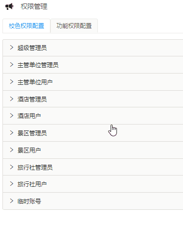
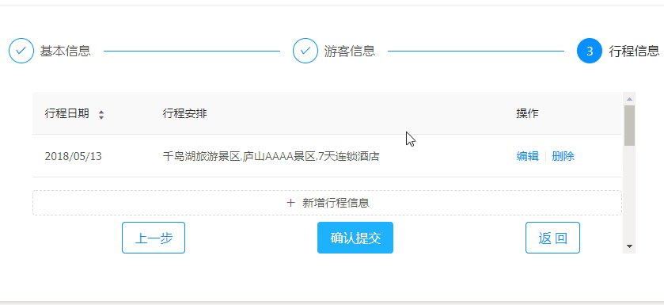
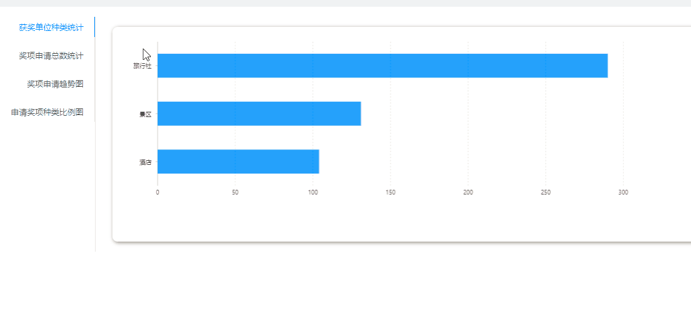

# 功能演示

## 1.1 账号用于区分核实用户身份

## 1.2 每个账号对应一个用户，用户可以维护自己的个人信息

## 1.3 用户通过用户名和密码登陆系统

## 1.4 每个账号归属一个企业单位

## 1.5 每个账号可以设置不同的角色权限

## 1.6 用户可以修改和重置密码

> 修改密码

> 重置密码

## 1.7 账号可以注册也可以由管理员创建

> 注册

> 创建

## 1.8 管理员可以管理本单位所辖的用户账号

> 江西省旅发委

> 南昌市旅发委

> 景德镇市旅发委

## 1.1+ 上级主管部门可以检查下级部门

> 省级单位

> 市级单位（南昌）

> 市级单位（上饶）

## 1.2+ 账号通过绑定手机找回密码

## 1.3+ 管理员设置角色权限和功能模块权限

## 1.4+ 用户可以自行修改 Logo

## 2.1 通过列表方式检查单位信息

## 2.2 查看单位详情，并进行修改

## 2.1+ 信息查询支持条件过滤

## 2.2+ 信息列表支持按单列排序

## 2.3+ 信息列表支持关键字搜索

## 2.4+ 信息列表支持动态调整字段

## 5.1 旅发委账号可以查看、管理所设奖项

## 5.2 涉旅单位可以通过列表或详情的方式，检查奖项信息

## 5.1+ 奖项管理支持上传奖项图片，并进行在线编辑

## 5.2+ 奖项信息文本支持富文本编辑和图文混排

## 6.1 旅行社可以查看奖项信息

## 6.2 旅行社可以针对某奖项提交申请

## 6.3 旅行社可以管理已经提交的申请

## 6.4 系统以列表方式展示旅行社提交的全部申请

## 6.5 可以查看某个申请的详情（包括进度和结果）

## 6.1+ <特定线路旅游奖励>、<包机专列旅游奖励>、<专列入镜旅游奖励>、<入境游客人数增幅排名前十奖励>、<客源地投放江西旅游产品广告奖励>、<客源地推广售卖江西旅游产品奖励>、<自助赴境旅游促销奖励>、<邀请境外媒体或涉旅企业入赣踩线考察奖励><幸运奖励>

## 6.2+ 奖项申请提供向导

## 6.3+ 游客信息支持动态新增

## 6.4+ 行程信息支持输入自动匹配

## 7.1 景区、酒店的用户账号可以查看所设的奖项信息
## 7.2 景区、酒店的用户可以检查所有涉及到自己单位的申请
## 7.3 系统以列表方式展示景区或酒店涉及到的全部申请
## 7.4 提供给出核验意见，并提交核验结果

## 7.1+ 信息查询支持条件过滤
## 7.2+ 信息列表支持按单列排序
## 7.3+ 信息列表支持关键字搜索
## 7.4+ 信息列表支持动态调整字段

## 8.1 各级旅发委的用户可以检查所有自己单位所辖旅行社的申请
## 8.2 系统以列表方式展示各级旅发委所辖旅行社的全部申请
## 8.3 可以给出审批意见，并提交审批结果

## 8.1+ 信息查询支持条件过滤
## 8.2+ 信息列表支持按单列排序
## 8.3+ 信息列表支持关键字搜索
## 8.4+ 信息列表支持动态调整字段

## 9.1 按不同奖项进行统计
## 9.2 按不同地区进行统计
## 9.3 按不同旅行社进行统计
## 9.4 按不同景区进行统计
## 9.5 按不同酒店进行统计
## 9.6 按不同状态、核验/审批结果进行统计
## 9.7 统计申请数量
## 9.8 统计游客人数（如果有）
## 9.9 统计奖励金额（如果有）
## 9.1+ 支持<特定线路旅游奖励>、<包机专列旅游奖励>、<专列入镜旅游奖励>、<入境游客人数增幅排名前十奖励>、<客源地投放江西旅游产品广告奖励>、<客源地推广售卖江西旅游产品奖励>、<自助赴境旅游促销奖励>、<邀请境外媒体或涉旅企业入赣踩线考察奖励>功能进行统计

## 10.1 系统管理员可以对账号的历史操作进行检查和审计

## 10.2 系统管理员可以对用户信息、单位信息、奖项信息、申请信息等重要记录的历史操作进行检查和审计

## 11.1 可以对系统各项信息，进行概要性展示

## 11.2 省旅发委可以通过通知消息，向各级单位进行信息披露

## 11.3 省旅发委可以通过通知消息，向各级单位进行奖项申请结果公示；可以向各用户提示，审批流程中需要参与和完成的工作

## 12.1 支持地图定位旅发委、旅行社、景区、酒店

## 12.2 支持地图显示:奖项申报中的行程信息

## 13.1 系统支持主流浏览器的近期各种版本

> Chrome

> Firefox Chrome

> Edge/IE

## 13.2 系统支持桌面及移动端自适应

> 桌面端

> 平板

> 手机

## 13.3 系统提供 Windows 及 MacOS 的客户端程序

> Windows 操作系统

> MacOS 操作系统

# 附件

## 数据访问控制功能（江西省账号）

## 数据访问控制功能（南昌市账号）

## 数据访问控制功能（上饶市账号）

## 表格显示字段按需调整功能

## 表格按字段排序

## 表格按字段内容过滤

## 表格按字段内容搜索

## 组合搜索条件

## 组合搜索条件（清除）

## 用户操作的提示功能

## 重要记录的保护 及 用户操作结果的反馈

## 动态编辑旅行团成员名单

## 动态编辑旅行团行程

## 行程信息输入的自动匹配

## 行程信息输入的地图坐标显示

## 富文本编辑功能

## 图片上传的缩放和剪裁

## 地图标记功能

## 角色权限管理

## 重要记录的审计功能

## 结果统计功能

## 短信找回密码

## Windows操作系统 本地应用程序

## MacOS操作系统 本地应用程序

