# 功能演示

## 数据访问控制功能（江西省账号）

## 数据访问控制功能（南昌市账号）

## 数据访问控制功能（上饶市账号）

## 表格显示字段按需调整功能

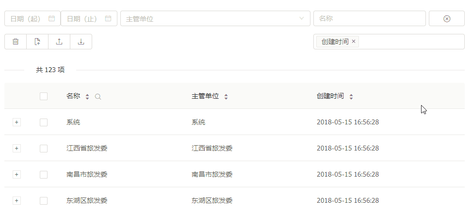

## 表格按字段排序

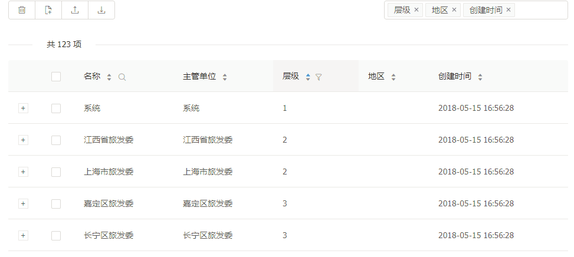

## 表格按字段内容过滤

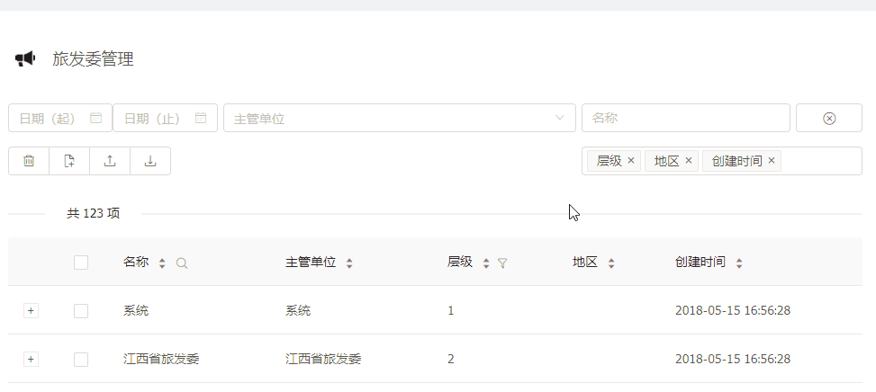

## 表格可组合搜索条件

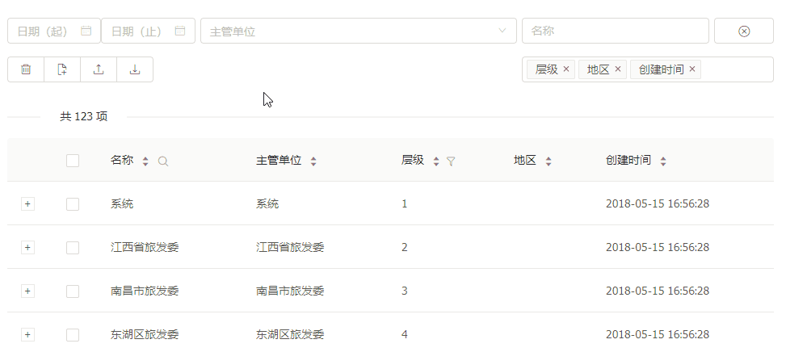

## 表格可组合搜索条件（主管部门）

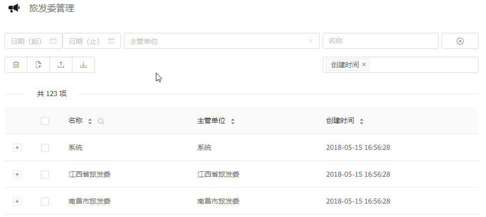

## 表格可组合搜索条件（清除条件）

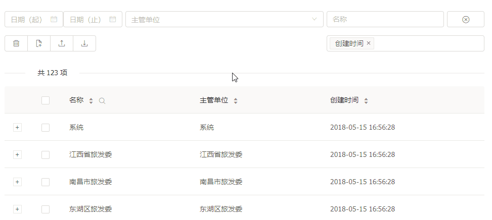

## 用户操作的提示功能

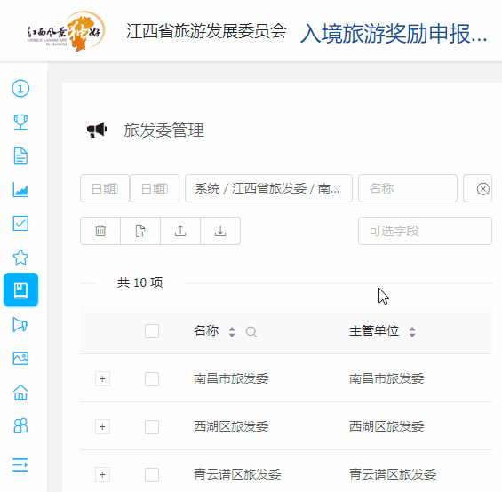

## 重要记录的保护 及 用户操作结果的反馈

## 动态编辑旅行团成员名单

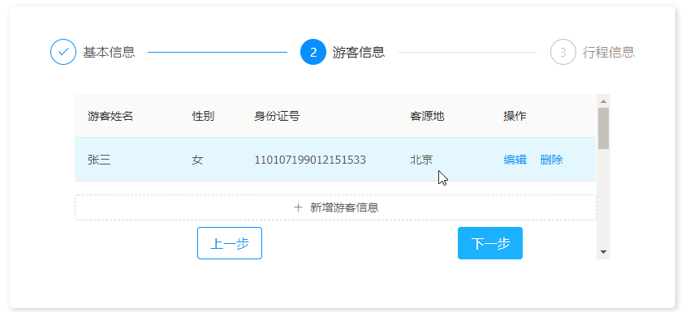

## 动态编辑旅行团行程

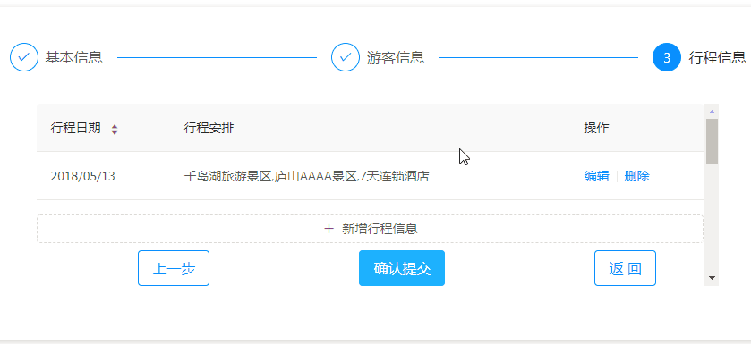

## 行程信息输入的自动匹配

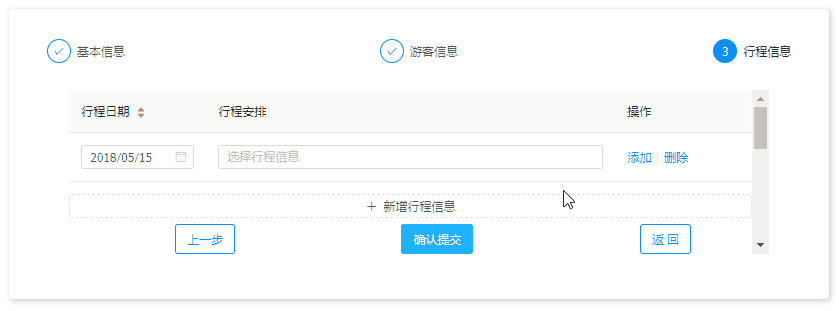

## 富文本编辑功能

## 图片上传的缩放和剪裁

## 地图标记功能

## 角色权限管理

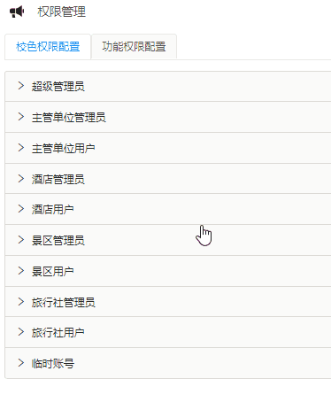

## 重要记录的审计功能

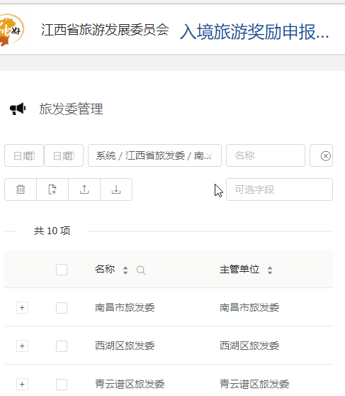

## 结果统计功能

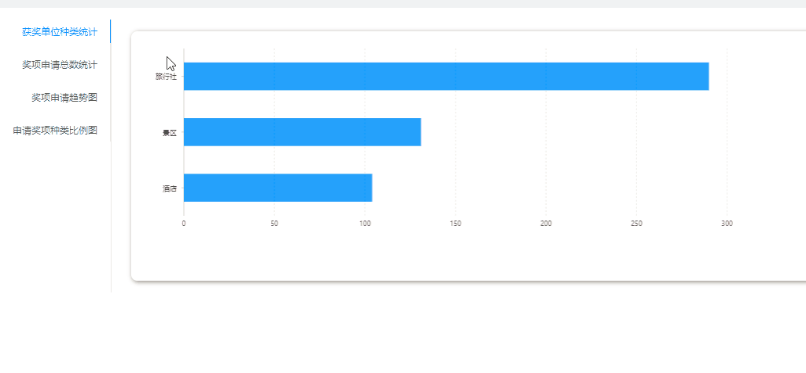

## 短信找回密码

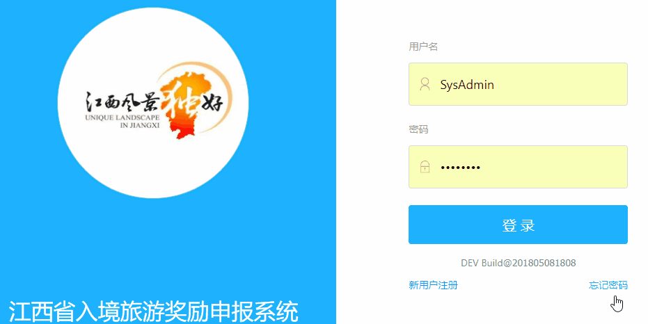

## Windows操作系统 本地应用程序

## MacOS操作系统 本地应用程序

