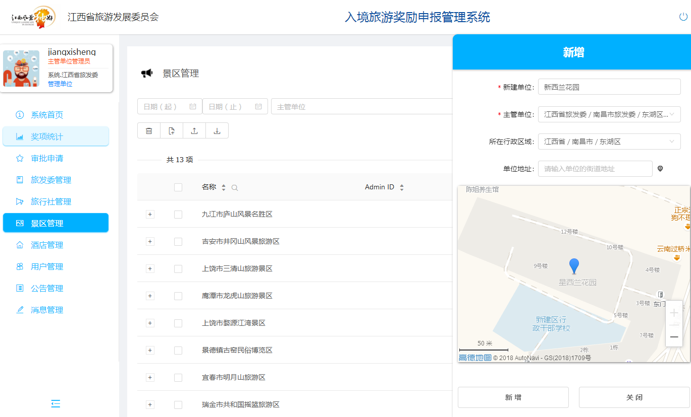

# 账号管理功能

###  1-1.账号用于区分和核实系统用户的身份；

------

###  1-2.每个账号，对应一个用户，用户可以维护自己的个人信息；

------

###  1-3.用户通过用户名和密码登陆系统；

------

### 1-4．在系统中，每个账号归属一个企业单位；

### 1-5.每个账号可以设置不同的角色权限；

------

### 1-6.用户可以修改和重置密码；

------

### 1-7.系统账号可以主动注册,但注册账号需要通过管理员审批后才能生效, 由管理员主动创建账号；

------

### 1-8.各级旅发委的管理员账号可以管理所辖单位的用户账号；

------

### 1-9.景区酒店管理员账号可以管理本单位用户账号；

------

### 1+1.账号管理具备主从管理权限，上级部门可以查看下级单位；

------

### 1+2.用户账户信息支持通过绑定手机，自助找回密码；

------

### 1+3.管理员可根据账号的角色权限，自由分配业务功能模块；

------

### 1+4.用户可自行修改用户ID-LOGO，并支持ID-LOGO自行编辑；

------

#各地市旅发委管理功能

### 2-1.可以通过列表方式，检查单位信息；

------

### 2-2.可以查看某个单位的详情，并进行信息更新；

------

### 2+1.查询信息支持查询条件过滤；
### 2+2.查询信息支持单列按规则排序
### 2+3.查询信息支持关键字搜索
### 2+4.查询信息列表支持自定义显示字段

------

#旅行社管理功能
### 3-1.可以通过列表方式，检查单位信息

### 3-2.可以查看某个单位的详情，并进行信息更新；

------

### 符合性审查

-----
#4景区管理功能

### 4-1.可以通过列表方式，检查单位信息；
### 4-2.可以查看某个单位的详情，并进行信息更新；

------

### 符合性审查

------

#5.奖项管理功能

### 5-1.省旅发委的用户账号可以查看、管理所设的奖项信息；

### 5-2.涉旅单位可以通过列表和详情的方式，奖项信息；

------

### 5+1.奖项的封面图支持自行上传并提供在线缩放裁剪功能。

### 5+2.奖项的说明信息支持在线富文本、图片混排

------

#6.申报管理功能
### 1.旅行社的用户账号可以查看所设的奖项信息；

### 2.旅行社用户可以针对某奖项提出申请；

------

### 3.旅行社可以管理本单位已经提出的申请；
### 5.可以查看某个申请的详情，包括核验进度和审批结果；

------

### 6+1.系统提供<特定线路旅游奖励>、<包机专列旅游奖励>、<专列入镜旅游奖励>、<入境游客人数增幅排名前十奖励>、<客源地投放江西旅游产品广告奖励>、<客源地推广售卖江西旅游产品奖励>、<自助赴境旅游促销奖励>、<邀请境外媒体或涉旅企业入赣踩线考察奖励><幸运奖励>等申报功能模块

### 6-2.奖项申请提供向导引导；
### 6-3.游客信息可编辑；
### 6-4.申报的行程信息支持自动过滤

------

#7复核管理功能

### 7-1.景区、酒店的用户账号可以查看上级单位设立的奖项信息；

------

### 7-2.景区、酒店的用户可以复核所有涉及到自己单位的申请；

------

### 7-3.系统以列表方式展示景区或酒店涉及到的全部申请；
### 7-4.景区或酒店提出复核意见，并提交核验结果。

------

### 7+1.列表方式支持条件过滤；
### 7+2.列表支持按某列进行排序；

### 7+3.列表支持对特殊列的文字搜索过滤；

### 7+4.列表支持动态调整字段的显示或隐藏；

#8审批及公示管理功能
### 1.各级旅发委的用户可以检查所有自己单位所辖旅行社的申请；

------
### 2.系统以列表方式展示各级旅发委所辖旅行社的全部申请；

------

### 3.可以给出审批意见，并提交审批结果；

------

### 1.列表方式支持条件过滤；
### 2.列表支持按某列进行排序；
### 3.列表支持对特殊列的文字搜索过滤；
### 4.列表支持动态调整字段的显示或隐藏

------

#9统计管理功能
### 1.按不同奖项进行统计；
### 2.按不同地区进行统计；
### 3.按不同旅行社进行统计；
### 4.按不同景区进行统计；
### 5.按不同酒店进行统计；
### 6.按不同状态、核验/审批结果进行统计；
### 7.统计申请数量；
### 8.统计游客人数（如果有）；
### 9统计奖励金额（如果有）；

### 支持<特定线路旅游奖励>、<包机专列旅游奖励>、<专列入镜旅游奖励>、<入境游客人数增幅排名前十奖励>、<客源地投放江西旅游产品广告奖励>、<客源地推广售卖江西旅游产品奖励>、<自助赴境旅游促销奖励>、<邀请境外媒体或涉旅企业入赣踩线考察奖励>功能进行统计。

# 10.审计管理功能

### 1.系统管理员可以对用户信息、单位信息、奖项信息、申请信息等重要记录的历史操作进行检查和审计；

### 2.系统管理员可以对单位信息的历史变更记录进行检查和审计；

# 11.通知消息及首页看板功能
### 1.可以对系统各项信息，进行概要性展示；

### 2.省旅发委可以通过通知消息，向各级单位进行信息公示；
### 3.省旅发委可以通过通知消息，向各级单位进行奖项申请结果公示；
### 可以向各用户提示，审批流程中需要参与和完成的工作

# 地图展示功能模块
### 1. 支持地图定位旅发委、旅行社、景区、酒店；
### 2. 支持地图显示；奖项申报中的行程信息

